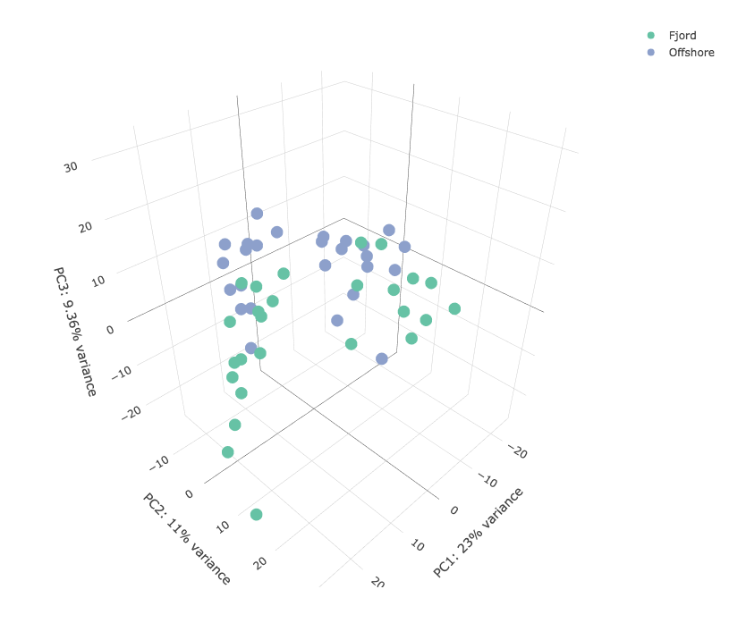
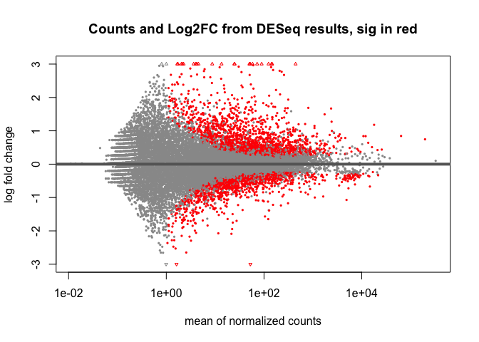

#### A representative example of fjord-offshore differential gene expression (DGE) analysis in Polar cod (*Boreogadus saida*) using DESeq2
This markdown comprises an example analysis using one of the three environmental pairings used in my Msc thesis titled *Transcriptomic basis for differentiation of fjord and coastal Polar cod (Boreogadus saida) populations*. Substantial additional documentation on the possible applications of DESeq2 can be found in its [vignette](https://bioconductor.org/packages/release/bioc/vignettes/DESeq2/inst/doc/DESeq2.html).

## Setup
Several libraries are used for visualization in addition to DESeq2, which does the actual DGE. 

```r
library(DESeq2)
library("pheatmap")
library("RColorBrewer")
library(ggplot2)
library(cowplot)
```

The input is:

1. a directory full of, in this case, output *htseq* files (plain text rows of genes with associated counts) example:

` gene-LOC115528735	1 `  
` gene-LOC115528736	0 `  
` gene-LOC115528737	136 `  
` gene-LOC115528738	0 `  
` gene-LOC115528741	1 `  

2. a sample sheet with sample names, year, and environment type (fjord or offshore) for example:

|Sample |	Treatment |	Year
|---|---|---|
|BesFj1704_L1 |	Fjord |	2017
|BesFj1706_L1 |	Fjord |	2017
|BesFj1707_L1 |	Fjord |	2017


```r
sampleNamesBes17 = read.delim('./Bes17-deseq2ready.txt', header = T)
sampleListBes17 = as.vector(sampleNamesBes17['Sample'])
conditionBes17 = as.vector(sampleNamesBes17[,"Treatment"])
yearBes17 = as.vector(sampleNamesBes17[,"Year"])
sampleFilesBes17 = unlist(lapply(sampleListBes17[,1], paste0, "_readcount_notrna_2short.txt"))
```
The vectors of each column in the sample list are then used as inputs to create a DESeq2-ready dataframe.

```r
sampleTableBes17Short <- data.frame(sampleName = sampleListBes17,
                                 fileName = sampleFilesBes17,
                                 condition = conditionBes17,
                                 year = factor(yearBes17))
head(sampleTableBes17Short)
```

```
##         Sample                                 fileName condition year
## 1 BesFj1704_L1 BesFj1704_L1_readcount_notrna_2short.txt     Fjord 2017
## 2 BesFj1706_L1 BesFj1706_L1_readcount_notrna_2short.txt     Fjord 2017
## 3 BesFj1707_L1 BesFj1707_L1_readcount_notrna_2short.txt     Fjord 2017
## 4 BesFj1708_L1 BesFj1708_L1_readcount_notrna_2short.txt     Fjord 2017
## 5 BesFj1709_L1 BesFj1709_L1_readcount_notrna_2short.txt     Fjord 2017
## 6 BesFj1710_L1 BesFj1710_L1_readcount_notrna_2short.txt     Fjord 2017
```
Once outliers are identified (downstream during sample to sample distance analysis) they can be effectively removed at this step. Otherwise, the *DESeq2DataSet* (DDS) can be generated via *DESeqDataSetFromHTSeqCount* because we are working from *htseq* read counts.
At this stage different factors can be fed to "design" to determine how the dataset is created. In my analysis, condition (fjord vs. offshore) is the most interesting factor so it is the key to my dataset design.

```r
ddsHTSeqBes17Short <- DESeqDataSetFromHTSeqCount(sampleTable = sampleTableBes17Short,
                                              directory = directoryBes17Short,
                                              design= ~ condition)
```
## Quality assurance and control (QAQC)
The first step of QAQC is removing genes (rows in the dataset) with less than 5 reads. Here we can see the difference in rows pre and post filtering.

```r
keepBes17Short <-rowSums(counts(ddsHTSeqBes17Short)) >=5
ddsHTSeqBes17Short_keep <- ddsHTSeqBes17Short[keepBes17Short,]
nrow(ddsHTSeqBes17Short)
```

```
## [1] 28955
```

```r
nrow(ddsHTSeqBes17Short_keep) 
```

```
## [1] 20759
```
Simple normalization is done via the built in *vst* function.
VST calculates a variance stabilizing transformation from the fitted dispersion-mean relation(s) and then transforms the count data (normalized by division by the size factors or normalization factors). This yields a matrix of values which are now approximately homoskedastic (having constant variance along the range of mean values). The transformation also normalizes with respect to library size. 
The "cooks" assay can then be used to check for samples identified as outliers based on Cook's distance. The default threshold for this is to use the 99% quantile of the F(p,m-p) distribution (with p the number of parameters including the intercept and m number of samples). A return of ` NULL ` signifies no outliers were identified.
At this stage: rows = genes (gene id used to capture greatest number of reads in alignment), columns = samples
colData can be used to extract condition and size factor by sample (row)

```r
normalizedBes17Short <- vst(ddsHTSeqBes17Short_keep,blind = F)
assays(ddsHTSeqBes17Short_keep)[["cooks"]]
```

```
## NULL
```
The next step is a graphical quality check using the top 100 genes normalized by read counts to construct a heatmap of gene representation by sample.

```r
selectBes17Short <- order(rowMeans(counts(ddsHTSeqBes17Short_keep,normalized=FALSE)),
                       decreasing=TRUE)[1:100] # number of top genes
Bes17qa <- as.data.frame(colData(ddsHTSeqBes17Short_keep))[,"condition"]

assayBes17normal = assay(normalizedBes17Short[selectBes17Short,]) 
pheatmap(assayBes17normal, cluster_rows=FALSE, show_rownames=T, show_colnames=TRUE,  
         cluster_cols=FALSE, main="Bes17 2Short heatmap, VST normalized data, top 100 genes by normalized read counts", fontsize=5)
```


Next, the sample to sample distances are compared. This is where individual sample outliers emerge most prominently.
A heatmap of this distance matrix gives us an overview over similarities and dissimilarities between samples. We have to provide a hierarchical clustering hc to the heatmap function based on the sample distances, or else the heatmap function would calculate a clustering based on the distances between the rows/columns of the distance matrix.

```r
sampleDists <- dist(t(assay(normalizedBes17Short)))
sampleDistMatrix <- as.matrix(sampleDists, rownames = TRUE)
colors <- colorRampPalette( rev(brewer.pal(9, "RdYlBu")) )(255)

pheatmap(sampleDistMatrix,
         clustering_distance_rows=sampleDists,
         clustering_distance_cols=sampleDists,
         treeheight_col = 10,
         treeheight_row = 10,
         show_colnames= T,
         show_rownames = T,
         col=colors,
         fontsize=6,
         legend=FALSE,
         main= paste("Bes17 2short sample-to-sample distance",as.character(Sys.time())))
```


This sample to sample distance plotting is done iteratively as outliers are removed to find the most reasonable dataset. In this case we can see that BF 1714, 1716 are likely outliers. This removal is based on qualitative visual assessment, but errs on the side of including rather than removing individuals.

```r
Bes_outliers = c("BesFj1716_L1", "BesFj1714_L2")
normalized_df_Bes = as.data.frame(assay(normalizedBes17Short))
Bes_noouts = normalized_df_Bes[,!(names(normalized_df_Bes) %in% Bes_outliers)] 

sampleDists_noouts_Bes <- dist(t(Bes_noouts))
sampleDistMatrix_noouts_Bes <- as.matrix(sampleDists_noouts_Bes, rownames = TRUE)

pheatmap(sampleDistMatrix_noouts_Bes,
         clustering_distance_rows=sampleDists_noouts_Bes,
         clustering_distance_cols=sampleDists_noouts_Bes,
         treeheight_col = 10,
         treeheight_row = 10,
         show_colnames= T,
         show_rownames = T,
         col=colors,
         fontsize=6,
         legend=FALSE,
         main= paste("Bes17 2short sample-to-sample distance",as.character(Sys.time())))
```


Now the DDS needs to be remade without outliers to make sure we are carrying the right dataset forward and updating the relevant variables.

```r
sampleTableBes17Short = sampleTableBes17Short[!sampleTableBes17Short$Sample %in% Bes_outliers, ]

ddsHTSeqBes17Short <- DESeqDataSetFromHTSeqCount(sampleTable = sampleTableBes17Short,
                                              directory = directoryBes17Short,
                                              design= ~ condition)
keepBes17Short <-rowSums(counts(ddsHTSeqBes17Short)) >=5
ddsHTSeqBes17Short_keep <- ddsHTSeqBes17Short[keepBes17Short,]
normalizedBes17Short <- vst(ddsHTSeqBes17Short_keep,blind = F)
```
## PCA plotting

```r
library(genefilter)
library(ggrepel)
library(plotly)
```
It is important to consider components in the PCA beyond the first two so here's a function modifying the DESeq2 *plotPCA* function to take which components are to be compared as arguments.

```r
plotPCA.any <- function (object, PCAa = 1, PCAb = 2, intgroup = "condition", ntop = 500, returnData = FALSE) 
{
  rv <- rowVars(assay(object))
  select <- order(rv, decreasing = TRUE)[seq_len(min(ntop, 
                                                     length(rv)))]
  pca <- prcomp(t(assay(object)[select, ]))
  percentVar <- pca$sdev^2/sum(pca$sdev^2)
  if (!all(intgroup %in% names(colData(object)))) {
    stop("the argument 'intgroup' should specify columns of colData(dds)")
  }
  intgroup.df <- as.data.frame(colData(object)[, intgroup, drop = FALSE])
  group <- if (length(intgroup) > 1) {
    factor(apply(intgroup.df, 1, paste, collapse = " : "))
  }
  else {
    colData(object)[[intgroup]]
  }
  ## Select the PCAs and percentVar that you like instead of 1 and 2
  d <- data.frame(PCa = pca$x[, PCAa], PCb = pca$x[, PCAb], group = group, 
                  intgroup.df, name = colnames(object))
  if (returnData) {
    attr(d, "percentVar") <- percentVar[1:4]
    return(d)
  }
  ggplot(data = d, aes_string(x = "PCa", y = "PCb", color = "group", label = "name")) + 
    geom_point(size = 1.5) + 
    xlab(paste0("PC",PCAa,": ", round(percentVar[PCAa] * 100), "% variance")) + 
    ylab(paste0("PC",PCAb,": ", round(percentVar[PCAb] * 100), "% variance")) + 
    geom_text(nudge_x = 1, nudge_y = -1, size = 1.1) +
    stat_ellipse()
}
```
This function can then be used to compare different PCA approaches, though PC1 and PC2 are the most explanatory with PC3 and PC4 explaining less than 10% of observed variance.

The same underlying data can be used to make a 3D PCA at this stage, though it is not much more useful than a grid of the multiple PCA comparisons on their own.

```r
plotPCA.3d <- function (object, intgroup = "condition", ntop = 500, returnData = FALSE) 
{
  rv <- rowVars(assay(object))
  select <- order(rv, decreasing = TRUE)[seq_len(min(ntop, 
                                                     length(rv)))]
  pca <- prcomp(t(assay(object)[select, ]))
  percentVar <- pca$sdev^2/sum(pca$sdev^2)
  if (!all(intgroup %in% names(colData(object)))) {
    stop("the argument 'intgroup' should specify columns of colData(dds)")
  }
  intgroup.df <- as.data.frame(colData(object)[, intgroup, drop = FALSE])
  group <- if (length(intgroup) > 1) {
    factor(apply(intgroup.df, 1, paste, collapse = " : "))
  }
  else {
    colData(object)[[intgroup]]
  }
  ## Select the PCAs and percentVar that you like instead of 1 and 2
  d <- data.frame(PC1 = pca$x[, 1], PC2 = pca$x[, 2], PC3 = pca$x[, 3], group = group, 
                  intgroup.df, name = colnames(object))
  if (returnData) {
    attr(d, "percentVar") <- percentVar[1:3]
    return(d)
  }
  fig <- plot_ly(d, x = ~PC1, y = ~PC2, z = ~PC3, color = ~group, text = row.names(d), hoverinfo = "text")
  fig <- fig %>% add_markers()
  fig <- fig %>% layout(scene = list(xaxis = list(title = paste0("PC1: ",signif(percentVar[1],3)*100,"% variance")),
                                     yaxis = list(title = paste0("PC2: ",signif(percentVar[2],3)*100,"% variance")),
                                     zaxis = list(title = paste0("PC3: ",signif(percentVar[3],3)*100,"% variance"))))
  fig
}
plotPCA.3d(normalizedBes17Short)
```


## Results
The *DESeq* and *results* functions in DESeq2 allows for the extraction of the actual relative differential gene expression (the genes being differentially expressed) based on all the filtering and normalization done so far. The resulting genes at this stage can be sorted by p value and exported as csv once coerced to dataframe format.

```r
dge_Bes17Short_keep <- DESeq(ddsHTSeqBes17Short_keep, parallel = TRUE)
```

```
## estimating size factors
```

```
## estimating dispersions
```

```
## gene-wise dispersion estimates: 2 workers
```

```
## mean-dispersion relationship
```

```
## final dispersion estimates, fitting model and testing: 2 workers
```

```
## -- replacing outliers and refitting for 340 genes
## -- DESeq argument 'minReplicatesForReplace' = 7 
## -- original counts are preserved in counts(dds)
```

```
## estimating dispersions
```

```
## fitting model and testing
```

```r
results_Bes17_treatment <- results(dge_Bes17Short_keep, contrast=c("condition","Fjord","Offshore"))

summary(results_Bes17_treatment) # probably worth saving
```

```
## 
## out of 20514 with nonzero total read count
## adjusted p-value < 0.1
## LFC > 0 (up)       : 1565, 7.6%
## LFC < 0 (down)     : 1142, 5.6%
## outliers [1]       : 0, 0%
## low counts [2]     : 5175, 25%
## (mean count < 1)
## [1] see 'cooksCutoff' argument of ?results
## [2] see 'independentFiltering' argument of ?results
```

```r
res_Bes17_treatment_ordered <- results_Bes17_treatment[order(results_Bes17_treatment$padj),]
sum(results_Bes17_treatment$padj < 0.01, na.rm=TRUE) #padj = p value adjusted for multiple testing, number of genes padj < 0.01:
```

```
## [1] 975
```

```r
# plot of counts and log2 FC of DESeq results table object
plotMA(results_Bes17_treatment, ylim=c(-3,3), colSig = "red", main = "Counts and Log2FC from DESeq results, sig in red") 
```



```r
ordered_Bes17frame <- as.data.frame(rownames(res_Bes17_treatment_ordered))
ordered_Bes17frame <- na.omit(cbind(ordered_Bes17frame,res_Bes17_treatment_ordered$pvalue,res_Bes17_treatment_ordered$padj,res_Bes17_treatment_ordered$log2FoldChange))
ordered_Bes17frame_sig <- ordered_Bes17frame[ordered_Bes17frame$`res_Bes17_treatment_ordered$padj` < 0.1,]
head(ordered_Bes17frame_sig)
```

```
##   rownames(res_Bes17_treatment_ordered) res_Bes17_treatment_ordered$pvalue
## 1                           gene-coq10b                       1.102758e-33
## 2                     gene-LOC115535721                       1.002766e-31
## 3                     gene-LOC115557485                       5.128407e-31
## 4                             gene-fosb                       6.960013e-31
## 5                     gene-LOC115533008                       7.601400e-30
## 6                     gene-LOC115555279                       2.647499e-29
##   res_Bes17_treatment_ordered$padj res_Bes17_treatment_ordered$log2FoldChange
## 1                     1.691961e-29                                   2.909046
## 2                     7.692720e-28                                   2.674961
## 3                     2.622838e-27                                   3.070513
## 4                     2.669687e-27                                   5.201626
## 5                     2.332566e-26                                   3.593690
## 6                     6.498500e-26                                   2.091863
```
This list of genes acts as the input for *FishEnrichr* gene annotation after gene ID conversion via the NCBI *eFetch Utility* (see [github pipeline](https://github.com/gghill/thesis-RNAseq/blob/main/pipeline.md).
The list of significantly differentially expressed gene ontologies (GO) is then used as the input for the final GO visualization in R. This input includes the annotation term and gene ID as well as a number of significance measures. In this case the conversion from from csv to txt via excel has caused the overlap (a fraction) to be converted to a date. Overlap is not used in this analysis, but would require special treatment prior to import to avoid this unwanted conversion.

```
##                                                Term      GO_id Overlap
## 1        inactivation of MAPK activity (GO:0000188) GO:0000188   6-Apr
## 2           hepatocyte differentiation (GO:0070365) GO:0070365   6-Mar
## 3         sister chromatid segregation (GO:0000819) GO:0000819  16-Jun
## 4            response to methylmercury (GO:0051597) GO:0051597  11-May
## 5              chromosome condensation (GO:0030261) GO:0030261  14-May
## 6 mitotic sister chromatid segregation (GO:0000070) GO:0000070  Sep-31
##        P.value Adjusted.P.value Old.P.value Old.Adjusted.P.value   Z.score
## 1 0.0000778139       0.02617845 1.92527e-04          0.040969749 -4.038103
## 2 0.0020673770       0.18330742 2.42818e-03          0.123027786 -5.118114
## 3 0.0000694198       0.02617845 5.22839e-05          0.020870389 -3.167958
## 4 0.0000984152       0.02617845 1.11160e-04          0.029568568 -3.198206
## 5 0.0003772050       0.05733510 2.73184e-04          0.041523965 -3.207974
## 6 0.0000114321       0.01216375 3.87743e-06          0.004125587 -2.050585
##   Combined.Score                                                    Genes
## 1       38.20526                                  dusp1;dusp2;dusp4;dusp5
## 2       31.63749                                            e2f8;apc;pck1
## 3       30.33427                    top2a;ncapd2;ncaph;mis12;ncapg;kif18a
## 4       29.50765                                 jun;rad51;tp53;sod1;sod2
## 5       25.28757                          top2a;ncapd2;ncaph;nusap1;ncapg
## 6       23.33378 cenpe;spdl1;ncapd2;ncaph;mis12;ccnb1;nusap1;ncapg;kif18a
```

```r
go_sig = Bes17_GO[Bes17_GO$Adjusted.P.value<.1,]
go_id = go_sig$GO_id
mat = GO_similarity(go_id, ont = "BP")
df = simplifyGO(mat, fontsize_range = c(10,18), min_term = 1, draw_word_cloud = T)
```

```
## Cluster 7 terms by 'binary_cut'... 3 clusters, used 0.06227803 secs.
```


Depending on the number of GO terms and clusters, the default plotting function may not provide the most legible result. In this case the table created via the *Go_similarity* and *simplifyGo* functions can be used to create a custom heatmap. *simplifyGO* can be assigned to a dataframe instead of just a plot, which is used as the input for our custom heatmap. In this case the GO terms were reduced to some general categories so clusters could be combined to create a more representative figure. This visualization exhibits the overlap between GO IDs and the terms representing the overarching biological processes. Only GO IDs corresponding to differentially expressed genes are included at this stage in analysis.

For most sites, the default plotting produced acceptable plots so this next step is highly optional/situational.

```r
row.names(df) = df$id
simple_terms = c("MAPK inactivation", "chromosome condensation/segregation","response to methylmercury", "chromosome condensation/segregation", "chromosome condensation/segregation", "MAPK inactivation","chromosome condensation/segregation")
df_terms = cbind(df, simple_terms)
map = as.data.frame(df_terms$simple_terms)
rownames(map) = df$id
colnames(map) = "GO_term"
colors <- colorRampPalette( rev(brewer.pal(9, "RdYlBu")) )(255)
anno_colors = list(
  GO_term = c("MAPK inactivation" = "#EDF8FB", 
              "chromosome condensation/segregation" = "#66C2A4",
              "response to methylmercury" = "#238B45")
)
pheatmap(mat,
         clustering_distance_rows=dist(mat),
         clustering_distance_cols=dist(mat),
         show_colnames= T,  
         treeheight_row = 0, 
         treeheight_col = 0,
         show_rownames = T,
         annotation_col = map,
         annotation_colors = anno_colors,
         annotation_names_row = T,
         annotation_row = map,
         annotation_names_col = T,
         col=colors,
         fontsize=10,
         legend=T)
```


