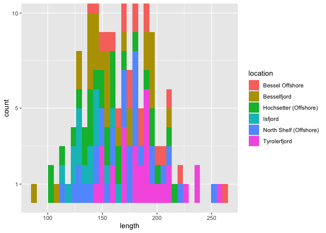

Statistical Analysis of Fish Condition
================
Griffin Hill
5/7/2021

#### Verification of sample inter-comparability for downstream RNA-seq comparisons

This notebook seeks to verify the validity of comparisons of *Boreogadus
saida* samples from fjord and offshore locations around the Greenland
Sea.

## Setup

A few libraries and other functions are critical to the analysis.

``` r
library(dplyr)
library(ggplot2)
library(cowplot)
library(stats)
library(scales)
ax_theme = theme(
  axis.title.x = element_text(size = 16),
  axis.text.x = element_text(size = 14),
  axis.text.y = element_text(size = 14),
  axis.title.y = element_text(size = 16))
```

## Import and mutation

The base dataframe includes fish identifiers, collection point, length
and weight, as well as a calculated Fulton K condition index.

``` r
all_fish = read.delim('./allfish_vis_ID.txt', header = T, dec = ',')
names(all_fish) = c("Fish_ID","GH_ID","location","length","weight","FultonK")
all_fish[all_fish=="Bessel_Shelf"] <- "Bessel Offshore" # more human legible
all_fish[all_fish=="Shelf-N"] <- "North Shelf (Offshore)"
all_fish[all_fish=="Hoch"] <- "Hochsetter (Offshore)"
all_fish[all_fish=="Tyroler"] <- "Tyrolerfjord"
all_fish[all_fish=="Svalbard, Isfjord"] <- "Isfjord"
```

This dataframe can then be modified to introduce some additional useful
parameters for downstream analyses such as “type” which describes which
fjord-offshore pairing a sample belongs to and “enviro” which describes
simply whether its from a fjord or offshore environment (regardless of
specific
pairing).

``` r
# mutate to add a column of "type" describing which fjord-offshore pair each location belongs to
all_fish = mutate(all_fish,
                  type=ifelse(grepl("Bess",location,fixed=T),"Bess",
                              ifelse(grepl("Tyr",location,fixed=T)|grepl("Hoch",location,fixed=T), "Tyr", "Isfj"))
)
# column with habitat type
all_fish = mutate(all_fish,
                  enviro=ifelse(grepl("Fj",GH_ID,fixed=T),"Fjord","Offshore")
)
head(all_fish)
```

    ##    Fish_ID      GH_ID        location length weight FultonK type   enviro
    ## 1 Bsa17242 BesOff1701 Bessel Offshore    171  33.10    0.66 Bess Offshore
    ## 2 Bsa17244 BesOff1702 Bessel Offshore    166  26.50    0.58 Bess Offshore
    ## 3 Bsa17245 BesOff1704 Bessel Offshore    140  16.10    0.59 Bess Offshore
    ## 4 Bsa17246 BesOff1705 Bessel Offshore    156  21.30    0.56 Bess Offshore
    ## 5 Bsa17247 BesOff1706 Bessel Offshore    220  64.50    0.61 Bess Offshore
    ## 6 Bsa17248 BesOff1707 Bessel Offshore    204  49.75    0.59 Bess Offshore

## Basic visualization

Throughout this analysis, functions are used to iteratively create a
specific type of plot for all location pairings or habitat types.

``` r
histo_overview <- function(loc){
  ggplot(data=subset(all_fish, location == loc),aes(x = length, y = after_stat(count))) + 
    geom_histogram(bins = 10) +
    scale_y_continuous(breaks = c(1,5,10)) +
    coord_cartesian(ylim = c(0, 10)) +
    scale_x_continuous(breaks = c(120,160,200), limits = c(100,220)) +
    labs(y="count", x="length (mm)") +
    ggtitle(paste0(loc)) +
    theme(legend.position = 'none') +
    ax_theme
}
ordered_locs = c("Besselfjord", "Bessel Offshore", "Tyrolerfjord", "Hochsetter (Offshore)", "Isfjord", "North Shelf (Offshore)")
histo_list <- lapply(ordered_locs, histo_overview)
plot_grid(plotlist = histo_list,nrow = 3)
```


This approach combined with `lapply` and `plot_grid` allows for the
creation of ready made figures with grids of plots. A custom theme
profile and specific ordering of the locations provides figures with
legible labels and conveniently organizes the columns of the resulting
figure by location type (fjord on the left, offshore on the right).

This kind of count based visualization can also be achieved on a single
figure via grouping, but is more difficult to decipher.


## Length vs. weight relationship

Now, it makes sense to explore the relationship between length and
weight in the sampled fish a bit more. This is our first inkling of
actual condition of the organism, which of course we’d like to be fairly
uniform across individuals used in the study.

``` r
no_log_fish <- f + geom_point(aes(color = location))  +
  geom_smooth(method='lm',formula=y ~ x) +
  theme(legend.position = "bottom") +
  labs(x="length (mm)", y="weight (g)") +
  ggtitle("length weight relationship") +
  ax_theme
no_log_fish
```


It is apparent that this may not be the best fit as the regression is
linear and the data appears to be slightly curved. We can assess the fit
using the residuals with the goal being no pattern in the residuals
vs. fitted plot and similar variance over the whole range of the data.

``` r
par(mfrow=c(2,2))
plot(lm(all_fish$weight ~ all_fish$length, all_fish))
```


Obviously our residuals have some shape and there may be a better way to
fit a model to this data. Based on the assumption of homogeneity of
variance over the entire sampled population, we can justify a log10
transformation of the
data.

``` r
log_fish <- ggplot(all_fish,aes(x=log10(length),y=log10(weight),location)) + geom_point(aes(color=location)) +
  geom_smooth(method = 'lm',formula=y~x) +
  theme(legend.position = 'bottom') +
  labs(x="log10(length (mm))", y="log10(weight (g))") +
  ggtitle("log10 transformed length weight relationship") +
  ax_theme
log_fish
```


This looks like a much better fit, but we can verify with the residual
plot again.

``` r
par(mfrow=c(2,2))
plot(lm(log10(all_fish$weight) ~ log10(all_fish$length),all_fish))
```


Residuals look good as well, so now we can use this log transformation
going forward and break down our visualization by location.

``` r
log_lw_overview <- function(loc){
  ggplot(data=subset(all_fish, location == loc),aes(x = log10(length), y = log10(weight))) + 
    geom_point() +
    geom_smooth(method = 'lm',formula = y~x) +
    scale_y_continuous(limits = c(.5,2)) + # can comment out to scale or unscale
    scale_x_continuous(limits = c(2,2.4)) + # can comment out to scale or unscale, could modify function to take a preference
    labs(x="log10(length (mm))", y="log10(weight (g))") +
    ggtitle(paste0(loc)) +
    ax_theme
}
big_picture_list <- lapply(ordered_locs, log_lw_overview)
plot_grid(plotlist = big_picture_list,nrow = 3)
```

    ## Warning: Removed 1 rows containing non-finite values (stat_smooth).

    ## Warning: Removed 1 rows containing missing values (geom_point).

    ## Warning: Removed 1 rows containing non-finite values (stat_smooth).

    ## Warning: Removed 1 rows containing missing values (geom_point).

    ## Warning: Removed 3 rows containing non-finite values (stat_smooth).

    ## Warning: Removed 3 rows containing missing values (geom_point).

    ## Warning: Removed 1 rows containing non-finite values (stat_smooth).

    ## Warning: Removed 1 rows containing missing values (geom_point).


